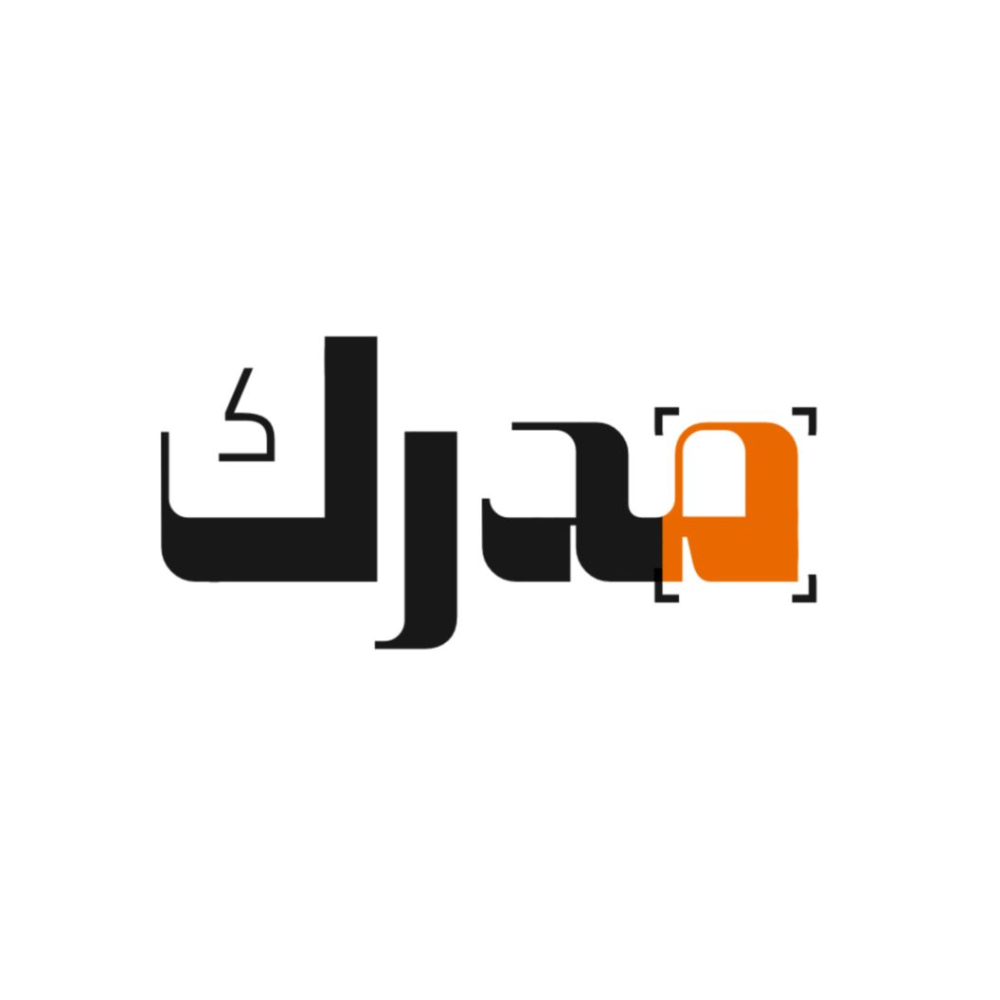
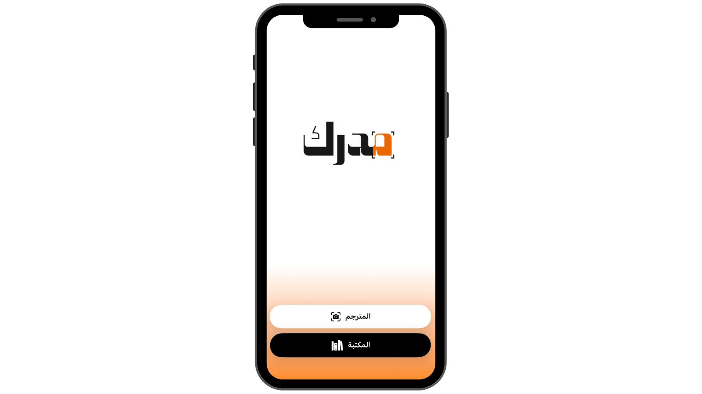
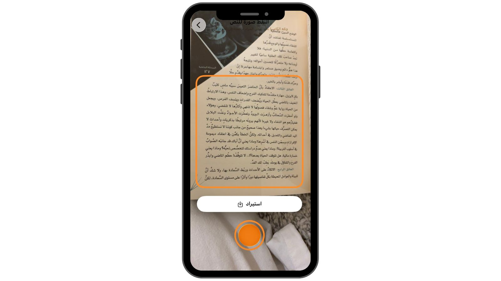
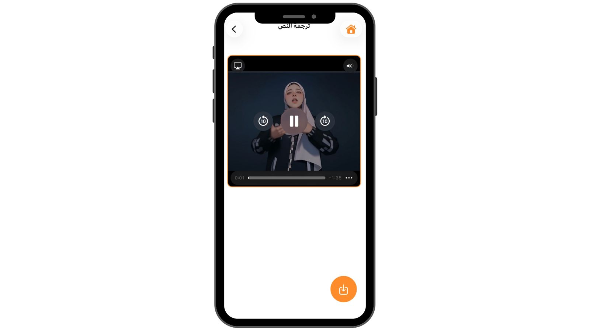

# Mudrk | مدرِك
**An accessibility-focused app that aims to translate written Arabic text into Sign Language using an animated avatar.**

  

---

## 📱 Preview

  
  
  

---

## 📌 Overview
**Mudrk** is an accessibility-oriented application designed to support Deaf and Hard-of-Hearing users in accessing written Arabic content.

While reading is often learned through auditory exposure, Sign Language is the primary and natural language for many Deaf individuals. This fundamental difference creates a linguistic gap when interacting with written text—especially long, complex, or academic content.

The app adopts a **visual-first approach**, using an animated avatar to represent Sign Language.  
The frontend is fully implemented, while the AI translation component is currently under research and development.

---

## 🎯 Problem Statement
- Sign Language is a **visual and descriptive language**, not a phonetic one.
- Written Arabic relies on **phonetic and syntactic structures** that differ significantly from Sign Language.
- This mismatch introduces additional cognitive effort during reading, not due to lack of understanding, but due to **structural linguistic differences**.
- Limited exposure to written text may affect vocabulary acquisition and make scientific or long-form content harder to access.

**Example:**

**Arabic:**  
> ماذا تريد أن تشرب؟

**Sign Language structure (approximate):**  
> هو – رغبة – شرب – سائل

---

## 🧠 Research Motivation

As an AI-driven project, **Mudrk** investigates the following research question:

> **Can Sign Language be represented as tokens within Large Language Models (LLMs)?**

Recent studies provide evidence supporting this hypothesis. Research such as:

- **Signs as Tokens: An Autoregressive Multilingual Sign Language Generator**
- **SignBot: Learning Human-to-Humanoid Sign Language Interaction**

demonstrates that Sign Language can be modeled as a **symbolic and structured representation**, enabling its integration into generative and sequence-based learning frameworks.  
These findings establish a theoretical foundation for future AI-based text-to-sign translation systems that go beyond literal mapping and instead capture semantic meaning.

---

## 💡 Proposed Solution
Mudrk aims to provide:
-  A ready **frontend prototype** for text input and visual output
- An **animated avatar** for Sign Language representation
- A planned **Generative AI layer** to understand semantic meaning rather than literal translation
- An inclusive, accessibility-first experience for written content

---

## 📝 Notes
- This repository represents a **research-driven prototype**, not a production-ready system.
- The AI translation engine is **not implemented yet** and is part of ongoing research.
- The prototype was presented to accessibility stakeholders, where accuracy in sign representation was highlighted as a key challenge.

---
